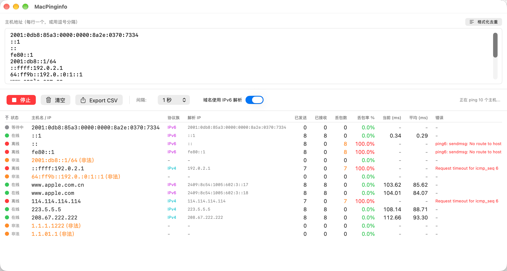

# MacPinginfo

[English](README.md) | [中文](README_zh.md)

Inspired by PingInfoView on Windows, a macOS-native concurrent multi-host ICMP ping monitoring tool designed for network engineers on Mac.



## Features

- Ping multiple hosts simultaneously with a persistent process per host
- Real-time latency monitoring and packet loss statistics
- CSV export support
- Adjustable ping interval (1s / 2s / 5s / 10s)
- Automatic DNS resolution
- IPv6 support: IPv4/IPv6 literals are always auto-detected; a "Resolve hostnames via IPv6" switch makes hostnames resolve AAAA-first with an automatic IPv4 fallback when IPv6 is unreachable
- macOS-native SwiftUI interface

## Requirements

- macOS 13.0+
- Xcode 15.0+

## Build

```bash
xcodebuild -scheme MacPinginfo -configuration Release build
```

The built app is located at `build/Release/MacPinginfo.app`.

## License

MIT License
